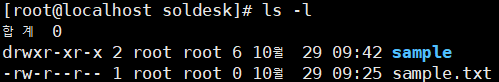

# Today's Linux Command 2024/10/29 

## 디렉토리 허가권과 소유권 (chmod, chown)
### Directoryの許可権と所有権

```
-rw-r--r-- 1 root root 0 10月 29 09:25 sample.txt
파일종류 허가권 링크개수 소유자 소유자그룹 파일크기 날짜 파일명
ファイル種類　許可権　リンク数　所有者　所有者グループ　ファイル容量　日付　ファイル名
```
#### 파일종류 ファイルの種類
```
-　一般ファイル                     
l　リンク
d  ディレクトリー                       
b  ブロックデバイス
c  キーボード、マウスなど
```
#### rwxの意味と数字
```
r (read)  ４
w (write) ２
x (実行)  １
基本ファイル：６４４
基本フォルダ：７５５
```
### chmod 許可権
```
数字方式で権限指定
chmod 441 sample.txt
chmod 777 sample
文字方式で権限指定
chmod [u,g,o]+rw sample.txt
chmod a=r sample.txt
chmod ug+wx sample.txt
```
### chown　所有権
```
chown rocky sample.txt => Change Owner
chown .rocky sample.txt => Change Owner Group
chown root.root sample.txt => Change Owner and Owner Group 
```
### 특수권한 特殊権限
####  set-UID = 4000(s), set-GID = 2000(s),  skicky Bit=1000(t)
```
# chmod 4666 aaa.txt

# chmod 2666 bbb.txt

# chmod 1666 ccc.txt

⇒

-rwSrw-rw- 1 root root 0 10월 29 14:10 aaa.txt
-rw-rwSrw- 1 root root 0 10월 29 14:31 bbb.txt
-rw-rw-rwT 1 root root 0 10월 29 14:31 ccc.txt
```
## 링크 파일 (하드 링크, 심볼릭 링크)
### Link File
### ln test hardlink
```
hardlink - 同じ位置に同じファイルを複製
```
### ln -s test softlink
```
linkの概念、testファイルが削除されたらlinkも動作しない
```
#### linkファイルの面白い点
```
hardlinkは、リンクされたファイルが消されても開けるが、コピーした時点のファイルの内容になる(作り直しても内容はそのまま)
一方、
symboliclinkは、消したファイルと同じ名前のファイルを作り、その中の内容を修正したら、symboliclinkの内容もその内容に変わる
Pathを参照しているという感じ
```
## 에디터 편집기 (nano, vi)
### nano
```
nano test1.txt
内容入力
Ctrl+X, y
```
### vi (機能が多い！)
```

```
## 프로그램 설치 / 설치 확인
### プログラムインストール、インストール確認
#### **rpm**, yum, **dnf**
### rpm
```
依存性がマイナス点

rpm -qa gzip ⇒ インストール確認
rpm -qf gzip ⇒  設置Path確認

rpm -ql gzip ⇒  Package List 表示
rpm -qi gzip ⇒ パッケージの情報表示

インストールと削除

⇒ rpm -Uvh PackageName.rpm     U(설치 또는 업데이트) v(설치과정 확인)  h(#########)

rpm -e PackageName.rpm          削　除
```
### dnf
```
rpmの依存性問題解決

dnf -y install パッケージ
dnf install パッケージ.rpm

dnf check-update  ⇒ update 確認

dnf update パッケージ  ⇒ 패키지 업데이트

dnf remove パッケージ

dnf info パッケージ ⇒ パッケージ情報確認
```
### God God Linux
```
Windowsは、インストールまで［プログラム検索、ダウンロード、exeファイル実行］の手続きが必要
LinuxはLinux専用リポジトリからダウンロード＋インストールしてくれる
＊Mirror Site Storage 
-> /etc/yem.repos.d/This.repo
しかもネットワーク接続なしでもインストール可能
```
### Myfolderにマウント
```
First, isoファイルconnect
umount /dev/cdrom
mkdir /media/cdrom
mount /dev/cdrom /media/cdrom
```
### This.repo -> dvd.repoに変更
```text
dvd.repo 새로운 파일에 내용 입력
新しいファイルに内容入力

[dvd-baseos]
name=Rocky Linux DVD BaseOS
baseurl=file:///media/cdrom/BaseOS/
gpgcheck=0

[dvd-appstream]
name=Rocky Linux DVD AppStream
baseurl=file:///media/cdrom/AppStream/
gpgcheck=0
```
### ネットワーク接続を切ってダウンロード
```
ifconfigで名前確認
ifconfig ens160 down
dnf -y install mariadb ⇒ 네트워크가 끊어져도 설치가 됨. dvd.repo에 기록된 url DVD를 참조해서 설치하기 때문
ネット枠接続が切れてもインストールできる。dvd.repoのurl DVDを参照してインストールするため
ifconfig ens160 up
```