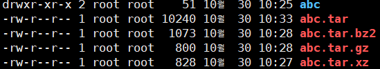

# Today's Linux Command 2024/10/30

## 파일 압축과 묶기 
#### ファイル圧縮
### 파일 압축
```
xz, bz2, hz, zip, Z などなど、、
xz と bz2 の圧縮効率がより良い
```
#### xz, bzip2
```
xz : xzファイルに圧縮、解除
xz [filename] / xz -d [filename].xz
bzip2 : bzip2ファイルに圧縮、解除
bzip2 [filename] / xz -d [filename].bz2
```
### 파일 묶기
```
Linux(UNIX)에서 '파일압축'과 '파일묶기'는 원칙적으로 별개 프로그램으로 수행
파일묶기 명령어는 'tar'이며, 확장명도 'tar'
```
### 파일묶기コマンド　tar
```
動作 c(묶기), x(풀기), t(경로확인)
オプション f(파일), v(과정보이기), J(tar+xz), z(tar+gzip), j(tar+bzip2)

tar cvf my.tar /etc/sysconfig/ ⇒ tarファイルに圧縮

tar cvfJ ⇒ まとめて圧縮

tar xvf  ⇒ 解除

tar xvfJ ⇒　圧縮解除して、tarファイルも解除
```

```
圧縮する場合、複数の圧縮方法がレベル別で存在しているので、圧縮する場合は圧縮効率を考えてえらぶとよい
```
## 파일 위치 검색하기
#### ファイルの居場所検索
### which
```
which コマンドの名前 => コマンドの居場所を検索
which passwd => /usr/bin/passwd
```
### find
```
find /etc -name *.conf =>　/etcの中の.confファイル検索
find /home -user rocky　=> /homeの中のuser rockyのファイル検索
find /user/bin -size +50k -size 100k => ファイルサイズが５０K～１００Kのファイル検索
```
### whereis
```
whereis passwd => システムの中のpasswd関連ファイルを全部検索
⇒ passwd: /usr/bin/passwd /etc/passwd /usr/share/man/man5/passwd.5.gz /usr/share/man/man1/passwd.1ossl.gz /usr/share/man/man1/passwd.1.gz
```
## GUI 네트워크와 방화벽
#### GUIネットワークとFirewall
### nmtui
```
GUI上のネットワーク設定画面
```
### firewall-config
```
GUI上のfirewall設定画面
런타임 -> 영구적으로 변경 / 서비스 선택 / 옵션 -> 다시불러오기
```

## 예약하기　予約
### cron 
#### 持続的な予約
周期的に繰り返される命令を自動的に実行できるように設定
関連daemonは"crond", 関連ファイルは"/etc/crontab"
```
  *    *    *     *    *       root     run-parts   /etc/cron.hourly
  分   時   日    月   曜日  ユーザー名    実行命令     コマンドの位置
00~59/1~24/1~31/1~12/1~7,0~6

/etc/crontab EXAMPLE
- 01 * * * * root run-parts /etc/cron.hourly
- 02 4 * * 8 root run-parts /etc/cron.daily
- 03 4 * * 0 root run-parts /etc/cron.weekly
- 42 4 1 * * root run-parts /etc/cron.monthly
```
### crondで予約してみよう
**systemctl status**/start/restart/stop **crond**     ⇒ Active
```
1. vi /etc/crontab
⇒ 01 3 15 * * root run-parts /etc/cron.monthly

2. cd /etc/cron.monthly ⇒ 設定したフォルダに入って、
vi backup.sh ⇒ shellファイルに下のコマンド入力

#!/bin/bash
set $(date)
fname="backup-$2$3tar.xz"
tar cfJ /backup/$fname /home


3.backup.shファイルに実行権限与える
chmod 755 backup.sh

4. システム時間を変更してちゃんと動作するか確認
date 011503002028 ⇒ 時間変更
systemctl restart crond ⇒ 一回 restart
ls /backup ⇒ しっかりbackupされてるのか確認
rdate -s time.bora.net ⇒ 시간 정상화
```
### at
#### 一回性予約
```
at 11:50pm today / at now + 1hours / at 12:00pm march 3
=>
at> init 6 + CtrlD
これで予約完了。
at -l => 予約リスト
atrm 予約番号 =>　予約取り消し
```