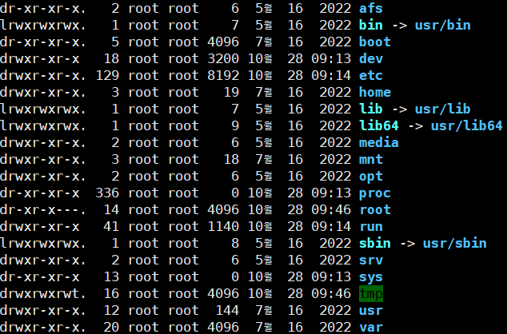

# with mongal shell script

ctrl + l : clear

## Root Directory
```
/bin : 명령어들
/sbin : 관리자 전용 명령어
/etc : 각종 설정 파일
/dev : 디바이스 장치 (CD ROM, HDD 등등)
/boot : 부팅관련 파일
/mnt : 마운트 연결 정보 (USB)
/var : 이메일 등 크기가 변하는 파일
/tmp : 임시 파일
/home : 사용자들의 정보와 개인 파일
```

## command
```
whoami - 로그인한 사용자 이름 표시 (ログインしたUSERの名前表示)

sudo su - root로 변경　（rootに変更）

pwd - 지금 있는 곳을 알려줌　（現在の居場所を表示）

cd (change directory) : cd 만 치면 홈 디렉토리로 돌아옴 
（home directoryに戻る）

cd .. : 위 디렉토리로 이동　（上のdirectoryに移動）

set : 유저 정보 표시　（USER情報表示）

printenv set값 : set값 표시　
```
## ls, touch, alias
### ls -a (all)
```text
. .. 를 포함한 모든 파일을 보여줌　（. .. を含んだすべてのファイルを表示）
```
### ls -l
```text
ls의 자세한 내용 출력 （詳しい内容を出力）

출력내용　（出力内容）
-rw-r--r-- 1 root     root      3444 Jul  5  2023 adduser.conf
```
### ls *.conf
```text
.conf 파일만 표시
```
### ls -il | grep .conf
```text
list 에서 .conf가 포함된 파일만 표시　（listから.confが含まれたファイルだけ表示）

| -> command 를 구분하는 역할　（｜は、コマンドを区別する役割）
```
### ls -al

```
d : 디렉토리 (directory)
l : 링크파일 (link file)
- : 일반파일 (file)
b : 시스템과 관련된 특수파일 (特殊file)
rwx : 읽기 쓰기 실행 권한 (read, write, 実行)
```
## 디렉토리 생성, 파일생성, 복사, 이동, 삭제
```
필수 명령어 : mkdir [-p], touch, cp, mv, rm, rm -rf, cd, cd.., cd ~, cat, rmdir
head, tail, more, less, file
```

#### 리눅스의 장점 : 현재 내 위치에서 모든 위치의 폴더, 파일 수정이 가능하다.

### mkdir [-p]
```text
디렉토리 생성 (directory作成)
mkdir test
폴더 안의 폴더도 한번에 생성 가능
mkdir -p test/tt1 test/tt2 test/tt3
```

### touch network_test 
```text
텅 빈 파일 생성 (空のファイル作成)
```

### cp / mv / rm -rf
```
복사, 이동, 삭제 (copy, move, remove)
cp anaconda-ks.cfg test/aaa.cfg
mv anaconda-ks.cfg test/aaa.cfg
rm -rf test/aaa.cfg
```

### ifconfig | grep inet > network_test
```text
덮어쓰기　（上書き）
```
### ifconfig | grep inet >> network_test 
```text
추가 （追記）
```

### `alias ls="ls -l"` 
```text
ls 명령어를 "ls -l"의 의미로 변경　（コマンドの意味変更）
```

### `unalias ls `
```text 
변경사항 삭제（変更取り消し）
```

# 함수 (関数)

### function 関数名() {コマンド;}
### function test() { ls -al /etc | grep .conf;}
### create files() {}

```
create_files() {
  for letter in {a..z}; do
    touch "$letter.txt"
  done
}
함수 실행 명령어
create files
```

### declare -f [함수이름]
```text
함수들의 정보 확인　（関数らの情報確認）
```

