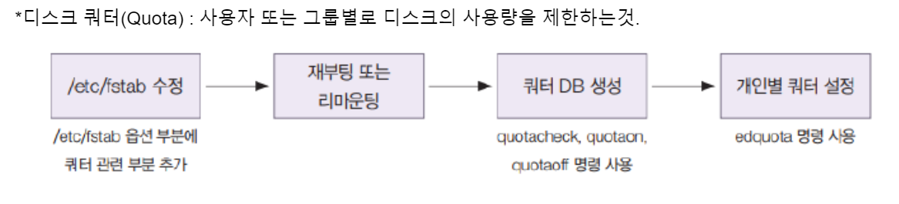
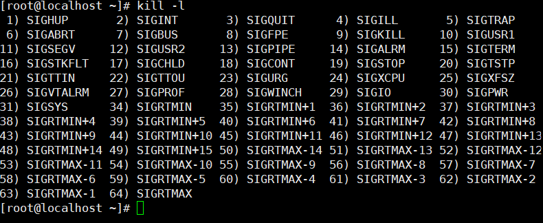
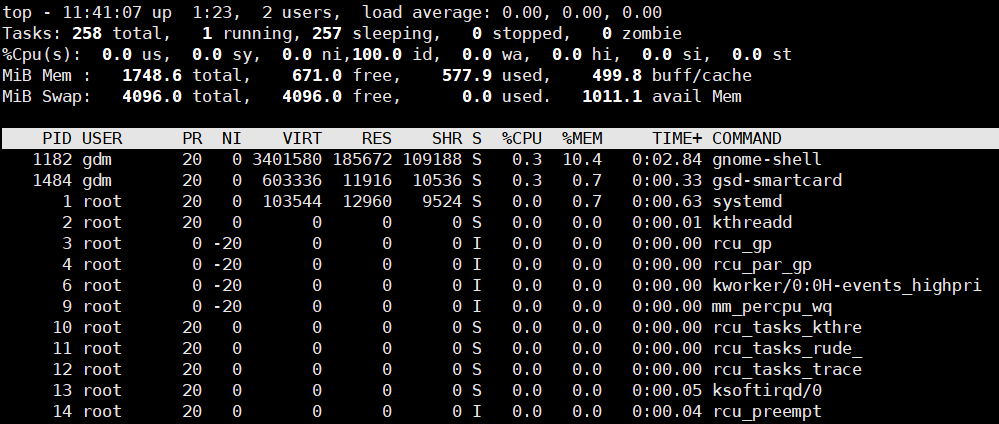

# Disk Quota
`User、GroupごとにDiskの使用量を制限すること`


1. 10G HDD fdisk(fdisk, mkfs,)やって, /testhomeフォルダにマウント
    
    ```bash
    fdisk /dev/sdb
    mkfs /dev/sdb1
    mkdir /testhome
    mount /dev/sdb1 /testhome
    ```
    
2. bts, izone user生成
    
    ```bash
    useradd -d /testhome/bts bts
    useradd -d /testhome/izone izone
    passwd bts (1234)
    passwd izone (1234)
    ```
    
3. fstabファイル設定と、リマウント
    
    /dev/sdb1     /testhome  ext4    **defaults.usrjqouta=aquota.user,jqfmt=vfsv0**    0 0
    
    mount —options  remount /testhome (mount -o remount /testhome)
    
4. Quota DB 生成
    
    ```bash
    **quotaoff -avug**  (all, visi, user, group)
    quotacheck -augmn (all, user, group
    **rm -rf aquota.***
    quotacheck -augmn
    **touch aquota.user quota.group**
    **quotacheck -augmn**
    **quotaon -avug**
    ```
    
    **quota** options : a (all), u (user) g(group) m(mount)  n(number) v(visual?)
    
5. user別の容量指定
    
    ```bash
    edquota -u bts
    Disk quotas for user bts (uid 1001):
      Filesystem                   blocks       soft       hard     inodes     soft     hard
      /dev/sdb1                        28          0          0          7        0        0
    
    blocks->0 **soft->30720 hard->40960** inodes->10
    ```
    
6. user(izone)に入り、容量警告がちゃんと出るか確認
    
    quota で自分の使用量確認可能
    
    ```bash
    su - izone
    [izone@localhost ~]$ cp /boot/vmlinuz-0-rescue-2765c4e1033a44f9a95f0771848b34c1 ./test2
    [izone@localhost ~]$ cp /boot/vmlinuz-0-rescue-2765c4e1033a44f9a95f0771848b34c1 ./test3
    **sdb1: warning, user block quota exceeded.
    [izone@localhost ~]$ quota
    Disk quotas for user izone (uid 1002): 
         Filesystem  blocks   quota   limit   grace   files   quota   limit   grace
          /dev/sdb1   32720*  30720   40960   6days      11       0       0**
    ```
    
7. rootに戻ってuserの容量を変更 soft(40M), hard(50M) に変更して、またuserに入って test3をコピーしてみよう
    
    ```bash
    edquota -u izone
    Disk quotas for user izone (uid 1002):
      Filesystem                   blocks       soft       hard     inodes     soft     hard
      /dev/sdb1                     32724      40720      50960         13        0        0
    su -u izone
    ```
8. btsをizoneと btsと同じ設定にして確認
    >edquota -p izone bts
    >repquota /testhome
    ```bash
    [root@localhost testhome]# edquota -p izone bts
    [root@localhost ~]# repquota /testhome
    *** Report for user quotas on device /dev/sdb1
    Block grace time: 7days; Inode grace time: 7days
                            Block limits                File limits
    User            used    soft    hard  grace    used  soft  hard
    ----------------------------------------------------------------------
    root      --      20       0       0              3     0     0       
    bts       --      28   40720   50960              7     0     0       
    izone     +-   43620   40720   50960  6days      14     0     0     
    ```
# 環境変数
`よく使用される情報を指定しておいて、必要な時に使うもの`
- Shell変数:いまのShellでしかつかえない
- 環境変数：すべてのところで使用可能
>set : すべての変数表示
>env：環境変数のみ表示
## Shell変数
echo $SHELL, echo $LANG, echo $PATH ⇒ Shell変数のPath表示

#### Shell変数の名前はつねに大文字で！

```bash
TEST=bts
echo $TEST
-> bts
```

##　環境変数

**export** SOL=desk ⇒ 環境変数 SOL 生成

```bash
[root@localhost ~]# export SOL=desk
[root@localhost ~]# env | grep SOL
SOL=desk

```

### 環境変数をShell変数に変更
export -n SOL
—> env から消えている（Shell変数に変更）

# プロセス
> ps, ps -ef
- ps -e -> 全体システムで実行されてるプロセス
- ps -f -> 現在のターミナルで実行されてるプロセス
##　プロセスの作動の仕方二つ
- inetd : HDDで存在していて、コマンドを打つと動作
    -> 速度は遅い、メモリは食わない、FTPなど
- standalone : RAMで常に待機、実行するとさっそく動作
　　-> 速度が速い、RAMメモリを食う、WebServerなど


>ps -f

```bash
UID          PID    PPID  C STIME TTY          TIME CMD
root        1779    1770  0 10:17 pts/0    00:00:00 -bash
root        2109    1779  0 11:23 pts/0    00:00:00 ps -f
```

UID : User ID

PID : Process ID  

PPID : Parents Process ID   

C : CPU使用量

STIME : StartTIME

TTY : Terminal種類とTeminal番号  

TIME : 実行時間

CMD : プログラムの名前

>ps -aux

```bash
USER         PID %CPU %MEM    VSZ   RSS TTY      STAT START   TIME COMMAND
root           1  0.0  0.7 103544 12960 ?        Ss   10:17   0:00 /usr/lib/systemd/systemd rhgb --switched-roo
t --system --deserialize 31
root           2  0.0  0.0      0     0 ?        S    10:17   0:00 [kthreadd]

```

VSZ : 仮想メモリの大きさ

RSS : 物理的メモリの大きさ

### pgrep -l -u root

## kill

```
-1 : Process restart
-2 : 実行中のプロセス中止
-9 : プロセス強制終了 (kill -9 httpd)
-15 : プロセス安全に整理して終了
-17 : ゾンビプロセス終了 (親がなくなったプロセス)
```
## top

```
PR : プロセスの優先順位
NI : Nice (優先順位変更)
VIRT : 仮想メモリの大きさ
RES : 物理的メモリの大きさ
SHR : メモリ共有
```

⇒ **優先順位(nice) 変更** :  -20~19, default 0 (もっとも優先順位が高い-> -20 最も低い-> 19) rootのみ変更可能

```bash
renice -n 5 -p 3238 => PID 3239番のプロセスの優先順位を５に変更
renice -n 5 -u 1002 => UIDが 1002のuserが実行させたプロセスをすべて5に変更
```

# シェルスクリプト
`Shell : コマンド解釈機＋プログラミング機能付き`
- Shellの種類：BoneShell,ConeShell,BashShell,CShell
- /etc/passwdでuserが使っているShell確認可能
- 形：Cshell : %, Bone, Cone, Bashshell : $
- システムにあるシェルの種類：/etc/shellsファイル
> chsh -s Shell変更

## スクリプトの生成/実行
> vi test.sh
```
#!bin/bash
echo "HostName":$USER
echo "HomeDir":$HOME
exit 0
```
> sh test.sh
- 属性変更なしの一回性実行
>chmod 700 host.sh + ./host.sh
- 属性変更してから実行
## スクリプトの変数
```bash
#!/bin/bash
test="SolDesk"

echo $test
echo "$test"
echo '$test'
echo \test
echo Name :
read ubuntu
echo '$test' = $test
echo ubuntu
exit 0
```
```
結果
[root@localhost ~]# sh test.sh
SolDesk
SolDesk
$test
test
Name :
1234 (私が打った)
#test = SolDesk
1234
```
### 算数もできます
```
#!/bin/bash
num1=100
num2='$num1 + 200'
num3=`expr $num1 + 200`
num4=`expr \( $num1 + 200 \) / 10 \* $num3`
echo $num2
echo $num3
echo `expr $num1 + $num3`
echo $num4
```
## parameter パラメータ
文字やコマンドを区分する構成要素
```bash
#!/bin/bash
set $(date)
echo "my name is <$0> and"
echo "first parameter <$1>, second parameter <$2>."
echo "전체 파라미터는 <$*>이다"
exit 0
```
## if文　条件文
- LinuxのShell上でプログラミングができる！わ！たのしい～（ほんとうに？）
```bash
#vi if2.sh

#!/bin/bash
if [ "Test" = "test" ]
then
    echo "True"       ⇒ 참일때 출력
else
    echo "False"     ⇒ 거짓일때 출력
fi

exit 0
```
read 変数とあわせて使うことも可能

```bash
vi name.sh

#!/bin/bash
echo What's your name?
read name
if [ $name = "azuma"]
then
    echo "wow~nice name~"
else
    echo "wow~great name~"
fi
exit 0
```
### if文で、 cron, sshd service 設置状態確認

rpm -qa cron, rpm -qa sshd

```bash
#!/bin/bash

fname=/lib/systemd/system/cron.service [sshd.service]

if [ -f $fname ] 
then
        head -5 $fname
else
        echo "No File...."
fi

exit 0
```
こんな感じに応用できる  **[ -f $fname ]**

## 数字比較表現
`-eq, -ne, -gt, -ge, -lt, -le`
```text
-eq : equal
-ne : not equal
-gt : greater than
-ge : great or equal
-lt : less than
-le : less or equal
```

## elif
if文法と同じくelifの後ろに記入
```shell
if [ $score -ge 90 ]
then
        echo "축하드려요~ A학점이네요 ^^"
elif [ $score -ge 80 ]
then
        echo "너는 B학점입니다."
elif [ $score -ge 70 ]
then
        echo "C ㅋ 학 ㅋ 점"
elif [ $score -g
then
        echo "D"
else
        echo "너는 F야. Fire Fighter라는 뜻이지. 소방수는 멈추지않는다구 Boy~"
fi

exit 0
```
# case文
if文より一つの変数について多くの選択肢を提示できる
```bash
vi case1.sh
#!/bin/bash
case "$1" in
        start)
                echo "Start";;
        stop)
                echo "Stop";;
        restart)
                echo "Restart";;
        *)
                echo "Error...";;
esac
```
## elif と case
elifは、より複雑な条件に対する比較が可能

caseは、一つの変数について細かな引き分けが可能だ。

```
9[0-9] → 90~99

100 | 9[0-9] → 100 and 90~99
```
```bash
#!/bin/bash

read -p "점수입력(99~0): " grade

case "$grade" in
        9[0-9])
                echo "A";;
        8[0-9])
                echo "B";;
        3)
                echo "C";;
        2)
                echo "D";;
        1)
                echo "E";;
        *)
                echo "그딴건없어";;
esac

exit 0
```

# for文
基本For文

```bash
#!/bin/bash
for bar in 1 2 3 4 5 6 7 8 9 10
do
			echo $var
done
exit 0
```

合計を出すFor文

```bash
#!/bin/bash

to=0

for i in {1..10}; do
        to=`expr $to + $i`
done
echo "전체 합계는: $to"
exit 0
```

リスト要素を出力するFor文

```bash
#!/bin/bash

list="동그라미 세모 네모 마름모"

for var in $list; do
        echo $var
done

exit 0
```
## 偶数だけ出力
`seq [firstnum] (飛ばしたい数) [lastnum]`
```bash
#!/bin/bash

for i in `seq 1 2 10`; do
        echo $i
done
exit 0
```
# input + while 문

read = 入力した内容を変数に入れる。

while文　無限反復

```bash
#!/bin/bash

name="김원준"
echo "너의 이름을 무엇이니"
read input
while [ $input != $name ]
do

        echo "틀렸어. 다시입력해."
        read input
done
echo "너의 이름을 잘 아는구나!"
exit 0
```

# 多数のuser　add/del

```bash
#!/bin/bash

for i in {0..10}; do
	$(useradd name$i);
done

exit 0
```

または while文を使ってでも具現化可能

```bash
#!/bin/bash

read -p "사용자를 몇명 만들지 입력해주세요." i

j=1

while [ $i >= $j ]
do
		$(useradd name$j);
		j=`expr $j+1`
done

exit 0
```
同じやり方でuserdel -rも可能