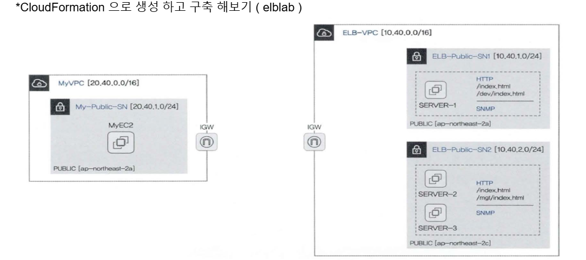

# ELB

- データの集中を防止するためのサービス
- トラフィックの負荷を防ぐためのサービス


## 種類
- ALB (Application Load Balancer) : アプリケーションを基に負荷分散処理 (速さに劣る)
- NLB (Network Load Balancer)：ネットワーク階層（TCP/UDP)をもとに分散処理（速い）
- CLB (Classic Load Balancer)：基本的な形。現在使わない。
- GLB (Gateway Load Balancer)：Gateway基盤。Firewallの機能

## 用語
- Listener リスナー : リクエストを受けて検査して、目的地に伝えてくれる役割（Port設定）
- Rule 規則：優先順位、条件に従って作業をこなしたり、中止する機能
- Target Group ターゲットグループ：同じサービスを提供しているEC2/S3などを集めておいたグループ

## CloudFormationで、ALBlabを生成、構築してみよう。

### [elblab.yaml](./etc/elblab.yaml)

- CloudFormation - Stack 作成 - テンプレートファイルアップロード
- アップロードして、作成開始したら自動的に構築してくれる
    - MyEC2, Server1, Server2, Server3 EC2が出来上がった。
- Public-Server 1,2 入って、/var/www/htmlの中確認
    ```
    [root@SERVER1 ~]# tree /var/www/html
    /var/www/html
    ├── dev
    │   └── index.html
    ├── index.html
    └── xff.php
    ```
- MyEC2で、　EC21, EC22, EC23　変数宣言
    ```
    [root@MyEC2 ~]# EC21=43.203.221.7
    [root@MyEC2 ~]# EC22=52.78.146.7
    [root@MyEC2 ~]# EC23=54.180.82.240
    [root@MyEC2 ~]# echo $EC21
    43.203.221.7
    [root@MyEC2 ~]# echo $EC22
    52.78.146.7
    [root@MyEC2 ~]# echo $EC23
    54.180.82.240
    [root@MyEC2 ~]# curl $EC21
    <h1>ELB LAB Web Server-1</h1>
    [root@MyEC2 ~]# curl $EC22
    <h1>ELB LAB Web Server-2</h1>
    [root@MyEC2 ~]# curl $EC23
    <h1>ELB LAB Web Server-3</h1>
    ```
### ALB 作成
- EC2 / ロードバランサー作成
- ネットワークマッピング、セキュリティグループ作成
- リスナー及びルーティング - ターゲットグループ作成して選択
- MyEC2で、ALB DNS Address 登録
    - MyALBのDNS住所コピー、変数に指定
    ```
    [root@MyEC2 ~]# ALB=myALB-918424486.ap-northeast-2.elb.amazonaws.com
    [root@MyEC2 ~]# echo $ALB
    myALB-918424486.ap-northeast-2.elb.amazonaws.com
    ```
    - ALBのインスタンスIP確認
    ```
    [root@MyEC2 ~]# dig $ALB +short
    3.39.121.14
    3.39.176.126
    ```
    - curl要請を$ALBに送ってみよう。一気に100回送って、それぞれ均等に表示されるのかも確認。
    ```
    [root@MyEC2 ~]# curl $ALB
    <h1>ELB LAB Web Server-3</h1>
    [root@MyEC2 ~]# curl $ALB
    <h1>ELB LAB Web Server-1</h1>
    [root@MyEC2 ~]# curl $ALB
    <h1>ELB LAB Web Server-1</h1>
    [root@MyEC2 ~]# curl $ALB
    <h1>ELB LAB Web Server-2</h1>
    [root@MyEC2 ~]# for i in {1..20}; do curl $ALB --silent; done | sort | uniq -c | sort -nr;
      7 <h1>ELB LAB Web Server-2</h1>
      7 <h1>ELB LAB Web Server-1</h1>
      6 <h1>ELB LAB Web Server-3</h1>
    [root@MyEC2 ~]# for i in {1..100}; do curl $ALB --silent; done | sort | uniq -c | sort -nr;
      34 <h1>ELB LAB Web Server-1</h1>
      33 <h1>ELB LAB Web Server-3</h1>
      33 <h1>ELB LAB Web Server-2</h1>
    ```
- Route53で、別称を指定した後、ALBと連動させればドメインでも接続できる。
https://sharplee7.tistory.com/131
### NLB 作成 
- ALBと作り方は同じ。
- Procotol だけUDPに変えて、Port Numberもすきな番号に変えてよい。ここではUDP/161に設定。
- Optionから、可用領域ルーティング構成⇒交差領域ロードバランシング活性化
- 均等にsnmpgetが送られていることを確認できる。
```
[root@MyEC2 ~]# for i in {1..50}; do snmpget -v2c -c public $NLB 1.3.6.1.2.1.1.5.0; done | sort | uniq -c | sort -nr
     18 SNMPv2-MIB::sysName.0 = STRING: SERVER2
     18 SNMPv2-MIB::sysName.0 = STRING: SERVER1
     14 SNMPv2-MIB::sysName.0 = STRING: SERVER3
[root@MyEC2 ~]# for i in {1..50}; do snmpget -v2c -c public $NLB 1.3.6.1.2.1.1.5.0; done | sort | uniq -c | sort -nr
     18 SNMPv2-MIB::sysName.0 = STRING: SERVER1
     17 SNMPv2-MIB::sysName.0 = STRING: SERVER3
     15 SNMPv2-MIB::sysName.0 = STRING: SERVER2
[root@MyEC2 ~]# for i in {1..60}; do snmpget -v2c -c public $NLB 1.3.6.1.2.1.1.5.0; done | sort | uniq -c | sort -nr
     25 SNMPv2-MIB::sysName.0 = STRING: SERVER2
     18 SNMPv2-MIB::sysName.0 = STRING: SERVER3
     17 SNMPv2-MIB::sysName.0 = STRING: SERVER1
```