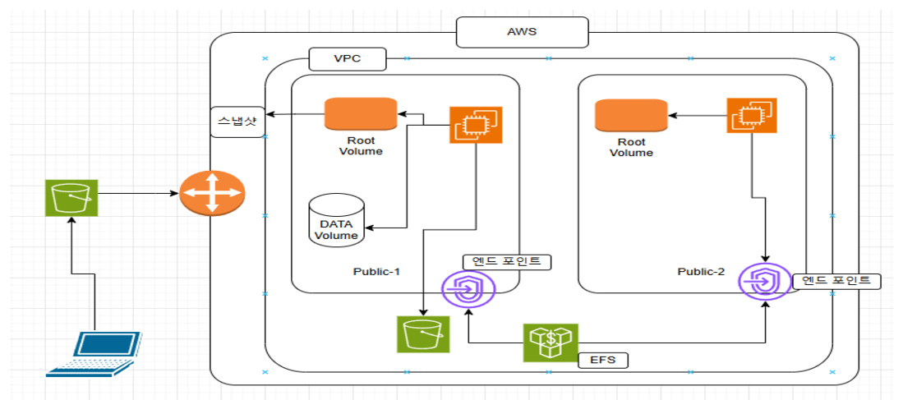
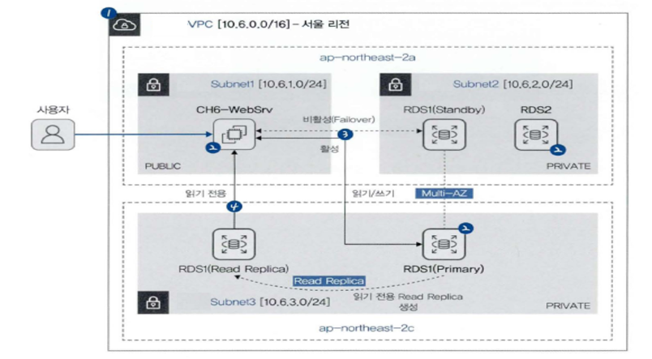

# 20241126 AWS S3, RDS 実習

# S3活用

### [s3lab.yaml](./etc/storagelab.yaml)
- EBS : EC2につなげる外装HDD（つながったEC2でしか使えない）同じ可用領域の中でのみ。
= EFS : EC2につなげる共有外装HDD - エンドポイントを通じて、違う可用領域でも使える。
### 関連コマンド
df -hT, df -h, df-hT /dev/xvda1, lsblk, blkid, /etc/fstab
## EBS作ってつなげる
## EFS作ってマウント
- EFSは、同じ可用領域でなくても、使うことができる。
1. EFS生成 - VPC, Network, Option 選択
    - Network - Security Group 新しく作ったGroupに変更
2. EFSとEC2-STG1連動
    - EFS変数宣言　`EFS=fs-064282b612afb7e7f`
    - `mount -t efs -o tls $EFS:/ /var/www/html/efs`
    - mount, df -hTでマウント状況確認
        ```
        [root@EC2-STG1 ~]# mount | grep efs
        sunrpc on /var/lib/nfs/rpc_pipefs type rpc_pipefs (rw,relatime)
        127.0.0.1:/ on /var/www/html/efs type nfs4 (rw,relatime,vers=4.1,rsize=1048576,wsize=1048576,namlen=255,hard,noresvport,proto=tcp,port=20678,timeo=600,retrans=2,sec=sys,clientaddr=127.0.0.1,local_lock=none,addr=127.0.0.1)

        [root@EC2-STG1 ~]# df -hT
        Filesystem     Type      Size  Used Avail Use% Mounted on
        devtmpfs       devtmpfs  477M     0  477M   0% /dev
        tmpfs          tmpfs     486M     0  486M   0% /dev/shm
        tmpfs          tmpfs     486M  496K  485M   1% /run
        tmpfs          tmpfs     486M     0  486M   0% /sys/fs/cgroup
        /dev/xvda1     xfs        10G  2.2G  7.8G  22% /
        tmpfs          tmpfs      98M     0   98M   0% /run/user/1000
        /dev/xvdc5     xfs        25G  213M   25G   1% /datac
        /dev/xvdc1     xfs       5.0G   68M  5.0G   2% /data
        127.0.0.1:/    nfs4      8.0E     0  8.0E   0% /var/www/html/efs
        ```
3. EFSとEC2-STG2も同じく連動
4. EFS Directoryにファイルを入れてみて、両サーバーで確認。
## S3 Storageに接続
### S3 Amazon Linux Terminal Command
- `aws s3 ls` s3 bucket リストを表示する
    ```
    [root@EC2-STG1 html]# aws s3 ls
    2024-11-25 02:09:32 cf-templates-yfsgv3ichcr0-ap-northeast-2
    2024-11-26 02:49:46 s3-efs0011
    ```
- EC2上で、S3Bucketを作ることもできる。
    - `aws s3 mb s3://[bucket name]`
    ```
    [root@EC2-STG1 html]# aws s3 mb s3://test-s3sol-private
    make_bucket failed: s3://test-s3sol-private An error occurred (BucketAlreadyExists) when calling the Createoperation: The requested bucket name is not available. The bucket namespace is shared by all users of the sPlease select a different name and try again.
    --> Buck Nameが重複したというエラー

    [root@EC2-STG1 html]# aws s3 mb s3://bu-s3-private
    make_bucket: bu-s3-private
    --> ちゃんと作られた
    ```
- EC2上で、S3に資源アップロード
    - S3 Bucket Name 変数指定　`S3PRI=bu-s3-private` 
    - `aws s3 cp /var/www/html/index.html s3://$S3PRI`
    ```
    [root@EC2-STG1 html]# aws s3 cp /var/www/html/index.html s3://$S3PRI
    upload: ./index.html to s3://bu-s3-private/index.html         
    ```
- EC2上で、S3の中のファイル確認
    - `aws s3 ls s3://$S3PRI`
    - `aws s3 ls s3://$S3PRI --recursive`
    ```
    [root@EC2-STG1 html]# aws s3 ls 
    2024-11-26 03:14:03 bu-s3-private
    2024-11-25 02:09:32 cf-templates-yfsgv3ichcr0-ap-northeast-2
    2024-11-26 02:49:46 s3-efs0011
    [root@EC2-STG1 html]# aws s3 ls s3://$S3PRI
    2024-11-26 03:16:16        356 index.html
    [root@EC2-STG1 html]# aws s3 ls s3://$S3PRI --recursive
    2024-11-26 03:16:16        356 index.html
    ```
- S3のなかのファイルをWeb上で見たければ、S3 Policy - GetObjectを追加しよう。
# RDS活用

### [dblab.yaml](./etc/dblab.yaml)
- AWSの関係型データベースであるAmazonRDSを作り、WebServerと連動させる。
- 高可用性を確保するためのMulti-AZ機能と、性能拡張のためのRead Replica機能について知る。

### 実習前に、stackで作られたWebServerのindex.phpファイルをみましょう。
- Mysql name, password : root, qwe12345
- DBName : sample
## RDS
1. RDS1, RDS2 生成
    - index.phpの情報通り作成。
    - **RDS1は、Multi-AZ機能ON,　RDS2はFree-TierでOFF**
    - 各々のエンドポイントリンクを、EC2WebServerに変数宣言する。
    ```
    RDS1=rds1.ctywsckcct1b.ap-northeast-2.rds.amazonaws.com
    RDS2=rds2.ctywsckcct1b.ap-northeast-2.rds.amazonaws.com
    ```
2. index.php ファイル修正
    - phpファイル内のdbaddressを、$RDS2変数に変えよう。
    - `sed -i "s/dbaddress/$RDS2/g" /var/www/html/index.php
    ```
    [root@CH6-WebSrv html]# sed -i "s/dbaddress/$RDS2/g" /var/www/html/index.php
    [root@CH6-WebSrv html]# head -5 /var/www/html/index.php
    <?php
    define('DB_SERVER', 'rds2.ctywsckcct1b.ap-northeast-2.rds.amazonaws.com');
    define('DB_USERNAME', 'root');
    define('DB_PASSWORD', 'qwe12345');
    define('DB_DATABASE', 'sample');
    ```
3. EC2 WebSiteに接続して、しっかりmysqlにconnectしたのか、table追加もできるのか確認。
4. RDSのMySQLでも実際にテーブル内容が変わったのか確認
    - `mysql -h $RDS2 -u -root -pqwe12345 -e "use sample; select * from EMPLOYEES;"`
    ```
    [root@CH6-WebSrv html]# mysql -h $RDS2 -u root -pqwe12345 -e "use sample; select * from EMPLOYEES;"
    +----+-------+-----------------+
    | ID | NAME  | ADDRESS         |
    +----+-------+-----------------+
    |  1 | hello | 192.168.111.100 |
    |  2 | mysql | 123.424.512.500 |
    +----+-------+-----------------+
    ```
5. これから、RDS1とRDS2の比較を行う。
    - `. /db_sh/SELECT_TABLE_RDS1.sh`
    - `. /db_sh/SELECT_TABLE_RDS2.sh`
ざっくりまとめると、RDS2はMulti-AZ機能がないため、電源を切るとそのままMySQLへの接続も切れる。

しかし、Multi-AZ機能がONになっているRDS1のほうは、再起動した場合、自動的に用意されていた予備サーバーをPrimary Serverとして使う。この機能を**failover機能**だという。
