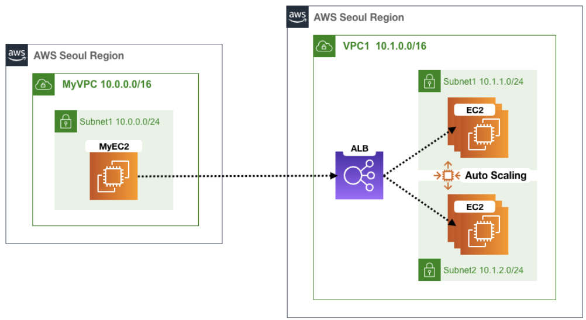
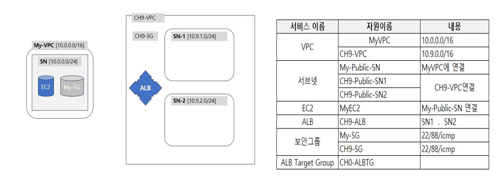
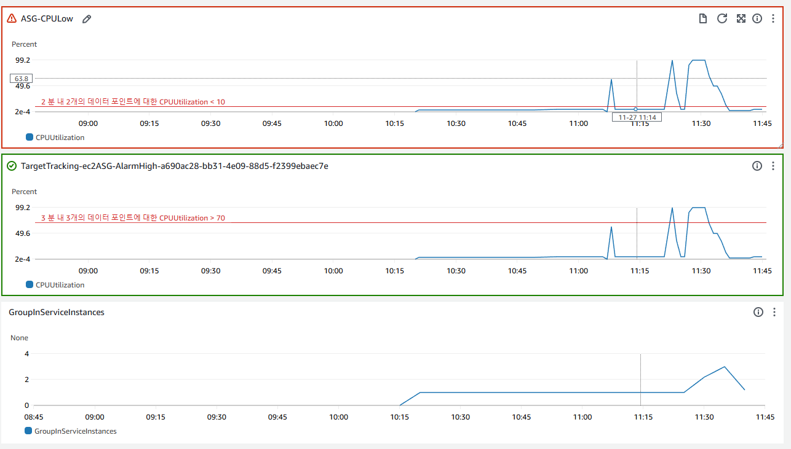

# 2024/11/27 AWS Auto Scaling 実習


### [ASLab.yaml](./etc/ASLab.yaml)
## Auto Scaling とは？
IT資源を自動的に拡張・縮小する機能の可変的サービス
- 垂直スケーリング
    - IT資源の容量を拡張・縮小する方法で、Scale UP/DOWN
- 水平スケーリング
    - IT資源の数を増やす方法で、Scale IN / OUT で分類

# 実習の流れ
EC2テンプレート作成 -> ASグループ作成　-> 調整Policy設定 -> CPU負荷発生 -> AutoScaling確認

1. yamlファイルでstack生成
2. MyEC2で、ALBを変数宣言してALBの情報確認 
    - `ALB=[ALB DNS住所]`
    ```
    [root@MyEC2 ~]# ALB=CH9-ALB-1297088924.ap-northeast-2.elb.amazonaws.com
    [root@MyEC2 ~]# echo $ALB
    CH9-ALB-1297088924.ap-northeast-2.elb.amazonaws.com
    [root@MyEC2 ~]# dig +short $ALB
    13.125.31.37
    ```
3. EC2スタートテンプレート作成
    - AutoScaling 指針 check
    - OS, インスタンス, Key Pair選択
    - セキュリティグループ選択
    - 高級設定 -> CloudWatchモニタリング活性化
    - ユーザーデータ書き込み
    ```bash
    #!/bin/bash
    RZAZ=`curl http://169.254.169.254/latest/meta-data/placement/availability-zone-id`
    IID=`curl 169.254.169.254/latest/meta-data/instance-id`
    LIP=`curl 169.254.169.254/latest/meta-data/local-ipv4`
    amazon-linux-extras install -y php8.0
    yum install httpd htop tmux -y
    systemctl start httpd && systemctl enable httpd
    echo "<h1>RegionAz($RZAZ) : Instance ID($IID) : Private IP($LIP) : Web Server</h1>" > /var/www/html/index.html
    echo "1" > /var/www/html/HealthCheck.txt
    curl -o /var/www/html/load.php https://cloudneta-book.s3.ap-northeast-2.amazonaws.com/chapter5/load.php --silent
    curl -o /var/www/html/cpuload.php https://cloudneta-book.s3.ap-northeast-2.amazonaws.com/chapter5/cpuload-aws.php --silent
    ```
4. AutoScaling Group 作成
    - Network CH9-VPC選択、サブネットSN-1,SN-2両方選択
    - モニタリングOption選択
    - AutoScalingPolicy設定
        - 平均CPU使用率が70以上になる場合、インスタンスを増やすように設定(Instance要求事項60秒に設定)
5. CloudWatchの警告作成およびAutoScaling縮小ポリシー追加
    - CloudWatch `CPUUtilization < 10`の場合警告する警報を作る。
    - AutoScalingGroup-Automatic scalingに入り、作っておいた警報を選び、削除-1-容量単位で縮小政策を追加。
6. CloudWatchのDashboard作成
    - 上の二つのポリシーと、AutoScalingGroupのインスタンス数を表す表をダッシュボードに追加。
7. CPUに負荷を与えてインスタンスが増えるのか確認、負荷が終わった後インスタンスが消されるのか確認
