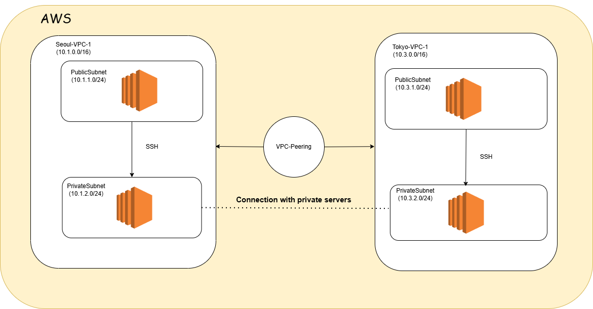
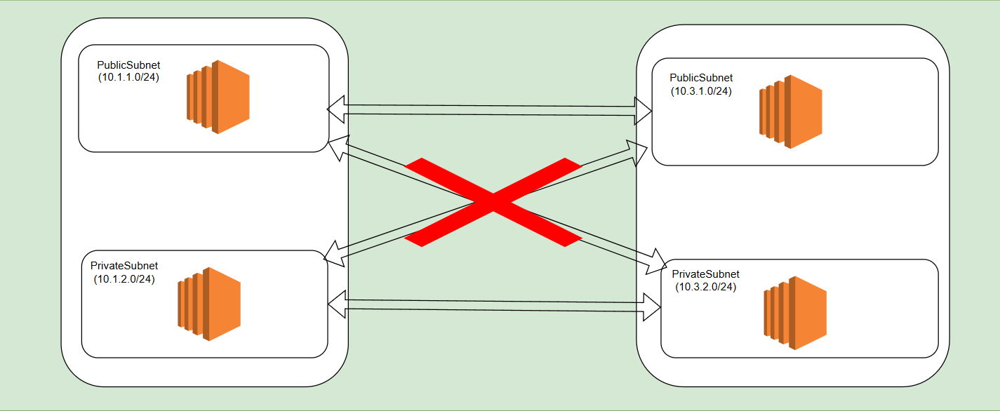

# 2024/11/28 VPC Peering

# VPC Peering とは
- それぞれ違うVPCをつないでくれる機能
    - ほかのリージョンにあるVPCともつなぐことができる。
    - 他のアカウントにあるVPCともつなげられる。

## VPC Peering 実習
1. Seoul RegionにVPCとEC2セットを二つ作ろう。
2. Public Addressには、当然pingが飛ぶ。しかし、private addressには通信できないはず。
    - VPC-1-EC2 private 10.1.0.9
    - VPC-2-EC2 private 10.2.0.5
    ```bash
    [root@ip-10-1-0-9 ~]# ping 10.2.0.5
    PING 10.2.0.5 (10.2.0.5) 56(84) bytes of data.
    ^C
    --- 10.2.0.5 ping statistics ---
    9 packets transmitted, 0 received, 100% packet loss, time 8194ms
    ```
    - 通信できません。
3. VPC - Peering Connect 設定して承諾
4. Routing TableにPeeringされたVPC経路追加
    - VPC1, VPC2 RTのルーティング編集 - 相手のVPC IP範囲をPeering Connect (両方全部)
5. もう一度PrivateIPにPingしてみると通信できることを確認可能。
    ```bash
    [root@ip-10-1-0-9 ~]# ping 10.2.0.5 -c 3
    PING 10.2.0.5 (10.2.0.5) 56(84) bytes of data.
    64 bytes from 10.2.0.5: icmp_seq=1 ttl=255 time=1.31 ms
    64 bytes from 10.2.0.5: icmp_seq=2 ttl=255 time=1.56 ms
    64 bytes from 10.2.0.5: icmp_seq=3 ttl=255 time=3.15 ms

    --- 10.2.0.5 ping statistics ---
    3 packets transmitted, 3 received, 0% packet loss, time 2003ms
    rtt min/avg/max/mdev = 1.316/2.013/3.159/0.817 ms

    [root@ip-10-2-0-5 ~]# ping 10.1.0.9 -c 3
    PING 10.1.0.9 (10.1.0.9) 56(84) bytes of data.
    64 bytes from 10.1.0.9: icmp_seq=1 ttl=255 time=1.54 ms
    64 bytes from 10.1.0.9: icmp_seq=2 ttl=255 time=1.39 ms
    64 bytes from 10.1.0.9: icmp_seq=3 ttl=255 time=1.40 ms

    --- 10.1.0.9 ping statistics ---
    3 packets transmitted, 3 received, 0% packet loss, time 2003ms
    rtt min/avg/max/mdev = 1.390/1.449/1.549/0.071 ms
    ```
## 自分で設計および実習

### Seoul - Tokyo のVPCPeeringを設計
    - Seoul-Private-EC2と、Tokyo-Private-EC2同士で通信できるようにしたい
    - 設計図にNAT入れるの忘れた。

1. Seoul VPC 構築
    - VPC, Subnet(Public-A, Private-C)
    - Internet Gataway, NAT Gateway
    - Routing Table Setting
    - Security Group
2. Seoul PublicEC2, PrivateEC2
    - Publicは普段通り
    - Privateは、高級設定で下のコード書き込み
    ```bash
    #!/bin/bash
    (
    echo "qwe123"
    echo "qwe123"
    ) | passwd --stdin root
    sed -i "s/^PasswordAuthentication no/PasswordAuthentication yes/g" /etc/ssh/sshd_config           
    sed -i "s/^#PermitRootLogin yes/PermitRootLogin yes/g" /etc/ssh/sshd_config
    systemctl restart sshd
    hostnamectl --static set-hostname Seoul-EC2
    ```
3. Tokyo VPC
    - 同じやり方で繰り返す。
4. Tokyo PublicEC2, PrivateEC2
    - 繰り返す
5. VPC Peering
    - どちらかからPeering要請を送る。
    - RoutingTableにPeering Connetingを追加する
        - このとき、Private Routing TableのみにPeering設定を追加する場合、Private同士のみ通信できる
6. 完成したものをざっくり図であらわすと下のようになる。


# WordPress
- WordPressとは、手やすくブログ、ショッピングモールなどのWebSiteを作れるオープンソースPlatformである。
### [wordpress.yaml](./etc/wordpress.yaml)
## WordPress構成実習
### 単一構成環境
- AllInOne インスタンスにapache,php,mariadbを全部入れてWordPress環境を構築 -> LAMPServer

1. httpd および php install
2. PHP Extensions 設置して適用
3. mariadbインストール
4. wordpressインストールして初期設定
5. 自分のEC2IPでWordpress接続
### 複合構成環境
- WebSV, RDS, EFSを用いて、WebServer用のサーバーと、DB用のサーバーを分離してみよう。
    - すでにWebSVにwordpressがインストールされてある+EFSもマウントされている
    - 我々がやることはRDS連動と、mariadbユーザ設定
1. EFSのマウントを確認
    - df -hT --type nfs4
2. RDSエンドポイントを変数で宣言
    - RDS = [RDS Endpoint]
3. wordpressの設定ファイルのlocalhost住所をRDSのエンドポイントに変える。
    - grep 'Database settings' /var/www/wordpress/wp-config-php -A15
    - sed -i "s/localhost/$RDS/g" /var/www/wordpress/config.php
    - grep on more time
4. wordpressで使う、RDSのwordpressdbデータベースを生成
    - mysql -h $RDS -uroot -pqwe12345 -e 'CREATE DATABASE wordpressdb;'
    - mysql -h $RDS -uroot -pqwe12345 -e 'show databases;'
5. WebSVのIPで接続してみたら、Wordpressの初期画面が出てくる。
